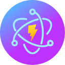

<p align="center">
  
</p>

<h1 align="center">create-elec-app</h1>

<p align="center">
  CLI tool para criar rapidamente aplicações desktop com Electron + Vite + React + TypeScript
</p>

<p align="center">
  <a href="https://www.npmjs.com/package/create-elec-app">
    
  </a>
  <a href="https://www.npmjs.com/package/create-elec-app">
    
  </a>
  <a href="https://github.com/create-elec-app/create-elec-app/blob/main/LICENSE">
    
  </a>
</p>

---

## 📚 Índice

- [🚀 Quick Start](#-quick-start)
- [✨ Features](#-features)
- [⚡ Stack](#-stack)
- [🎯 Uso](#-uso)
- [📁 Estrutura do Projeto](#-estrutura-do-projeto)
- [🧠 Arquitetura](#-arquitetura)
- [🔐 Segurança](#-segurança)
- [🧪 Desenvolvimento](#-desenvolvimento)
- [📦 Build](#-build)
- [🖥️ Gerar Executáveis](#️-gerar-executáveis)
- [🛠️ Configuração](#️-configuração)
- [🤝 Contribuição](#-contribuição)
- [📜 Licença](#-licença)

---

## 🚀 Quick Start

```bash
# Usando npx (recomendado)
npx create-elec-app meu-app

# Ou instale globalmente
npm install -g create-elec-app
create meu-app

# Entre no projeto
cd meu-app

# Instale as dependências
pnpm install

# Inicie o desenvolvimento
pnpm dev
```

> **Nota**: Este projeto recomenda o uso do [pnpm](https://pnpm.io/pt/) como gerenciador de pacotes.

---

## ✨ Features

- ⚡ **Scaffolding Rápido** - Crie projetos Electron em segundos
- 🔷 **TypeScript Nativo** - Código tipado do início ao fim
- ⚛️ **React Moderno** - Com Vite para desenvolvimento ágil
- 🔐 **Seguro por Padrão** - Configurações de segurança otimizadas
- 🧩 **Electron Builder** - Empacotamento para Windows, macOS e Linux
- 📁 **Estrutura Organizada** - Separação clara de responsabilidades
- ♻️ **Hot Reload** - Atualização instantânea no desenvolvimento
- 🧪 **Testes Incluídos** - Estrutura para testes com Vitest

---

## ⚡ Stack

| Tecnologia | Descrição |
|-----------|-----------|
| [Electron](https://www.electronjs.org/) | Framework para criar aplicações desktop nativas |
| [Vite](https://vitejs.dev/) | Build tool ultrarrápido |
| [React](https://react.dev/) | Biblioteca para construção de interfaces |
| [TypeScript](https://www.typescriptlang.org/) | Superset JavaScript com tipos |
| [Electron Builder](https://www.electron.build/) | Empacotamento de aplicações |
| [Vitest](https://vitest.dev/) | Framework de testes |

---

## 🎯 Uso

### Criar um novo projeto

```bash
# Sintaxe básica
npx create-elec-app <nome-do-projeto>

# Exemplos
npx create-elec-app my-electron-app
npx create-elec-app desktop-app
npx create-elec-app agenda-eletronica
```

### Opções do Projeto

Durante a criação, você será solicitado a:

1. **Nome do projeto** - Nome da pasta que será criada
2. **Diretório existente** - Se o diretório já existir, será perguntado se deseja sobrescrever
3. **Nome do pacote (package.json)** - Nome válido para o npm (opcional)
4. **Template** - Escolha o template inicial (React + TypeScript)

### Navegação Pós-Criação

```bash
cd meu-app           # Entre no projeto
pnpm install         # Instale as dependências
pnpm dev             # Inicie o desenvolvimento
```

---

## 📁 Estrutura do Projeto

Após criar um novo projeto, você terá a seguinte estrutura:

```
meu-app/
├── electron/                    # Processo Principal (Main Process)
│   ├── main.ts                 # Entry point do Electron
│   ├── preload.ts              # Script de preload (comunicação segura)
│   ├── electron-env.d.ts       # Tipos TypeScript
│   ├── electron-builder.json5  # Configuração do Electron Builder
│   └── public/                 # Arquivos públicos do Electron
│       ├── icon.ico           # Ícone Windows
│       ├── icon.png            # Ícone Linux
│       └── icon.icns           # Ícone macOS
│
├── src/                        # Processo de Renderização (Renderer)
│   ├── App.tsx                 # Componente principal React
│   ├── App.css                 # Estilos do App
│   ├── main.tsx                # Entry point React
│   ├── globals.css             # Estilos globais
│   ├── index.css               # Estilos base
│   └── assets/                 # Assets do React
│       └── react.svg           # Logo React
│
├── public/                     # Arquivos públicos
│   └── vite.svg                # Favicon
│
├── dist/                       # Build de produção (renderer)
├── dist-electron/              # Build de produção (main/preload)
├── release/                    # Executáveis gerados
│
├── index.html                  # HTML principal
├── package.json                # Dependências e scripts
├── tsconfig.json               # Configuração TypeScript
├── vite.config.ts              # Configuração Vite
├── electron-builder.json5       # Configuração Electron Builder
└── .gitignore                 # Arquivos ignorados pelo Git
```

---

## 🧠 Arquitetura

Este projeto utiliza a arquitetura **multi-process** do Electron, separando claramente as responsabilidades:

```
┌─────────────────────────────────────────────────────────────┐
│                      Aplicação Electron                       │
├─────────────────────────────────────────────────────────────┤
│                                                              │
│  ┌──────────────────┐         ┌──────────────────────────┐  │
│  │   Main Process   │         │     Renderer Process     │  │
│  │                  │         │                          │  │
│  │  • Janelas       │◄───────►│  • Interface React      │  │
│  │  • Menu          │   IPC   │  • UI/UX               │  │
│  │  • Tray          │         │  • Lógica de apresentação│  │
│  │  • Sistema       │         │                          │  │
│  └──────────────────┘         └──────────────────────────┘  │
│                                                              │
│  ┌──────────────────┐                                       │
│  │  Preload Script  │  Ponte de comunicação segura         │
│  │  (contextBridge) │  Expõe APIs específicas ao renderer  │
│  └──────────────────┘                                       │
│                                                              │
└─────────────────────────────────────────────────────────────┘
```

### Main Process (electron/main.ts)

O processo principal controla:
- Ciclo de vida da aplicação
- Criação e gerenciamento de janelas
- Acesso ao sistema de arquivos
- Integração com sistema operacional
- Menus e diálogos nativos

### Renderer Process (src/)

O processo de renderização é onde vive sua interface:
- Componentes React
- Estilos CSS
- Lógica de UI/UX
- Comunicação via IPC

### Preload Script (electron/preload.ts)

O preload é a ponte segura entre os dois processos:
- Expõe apenas APIs necessárias
- Mantém o contexto isolado
- Permite comunicação controlada

---

## 🔐 Segurança

O template implementa as melhores práticas de segurança do Electron:

### Configurações Aplicadas

```typescript
// electron/main.ts
webPreferences: {
  preload: path.join(__dirname, 'preload.mjs'),
  contextIsolation: true,      // ✅ Isola o contexto
  nodeIntegration: false,    // ✅ Sem acesso direto ao Node
  sandbox: true,              // ✅ Sandbox ativado
}
```

### O que cada configuração faz:

| Configuração | Descrição | Por que é importante |
|-------------|-----------|---------------------|
| `contextIsolation: true` | Isola o contexto do renderer | Previne acesso não autorizado ao contexto principal |
| `nodeIntegration: false` | Desabilita require() no renderer | Impede que código malicioso acesse APIs do Node |
| `sandbox: true` | Ativa sandbox do Chromium | Adiciona camada extra de proteção |

### IPC Seguro

A comunicação entre processos é feita via `contextBridge`:

```typescript
// electron/preload.ts
contextBridge.exposeInMainWorld('ipcRenderer', {
  on: (channel, listener) => ipcRenderer.on(channel, listener),
  send: (channel, ...args) => ipcRenderer.send(channel, ...args),
  invoke: (channel, ...args) => ipcRenderer.invoke(channel, ...args),
})
```

---

## 🧪 Desenvolvimento

### Scripts Disponíveis

```bash
pnpm dev        # Inicia o desenvolvimento com hot reload
pnpm build      # Gera build de produção
pnpm test       # Executa os testes
pnpm preview    # Visualiza o build de produção
```

### Fluxo de Desenvolvimento

1. **Inicie o servidor de desenvolvimento:**
   ```bash
   pnpm dev
   ```

2. **O Electron abrirá automaticamente** com hot reload ativado.

3. **Edite os arquivos** em `src/` para ver as alterações em tempo real.

4. **Edite arquivos do Electron** em `electron/` para alterar o comportamento da aplicação.

### Hot Reload

- **React (src/)**: Atualização automática ao salvar
- **CSS**: Atualização automática ao salvar
- **Main Process**: Reinicialização automática ao alterar arquivos em `electron/`

---

## 📦 Build

### Build do Projeto

```bash
pnpm build
```

Este comando:
1. Executa TypeScript check
2. Faz o build do Vite (renderer)
3. Faz o bundle do Electron (main/preload)
4. Gera os arquivos em `dist/` e `dist-electron/`

### Saída do Build

```
dist/                  # Build do renderer (Vite)
├── index.html
├── assets/
└── ...

dist-electron/         # Build do Electron
├── main.js
└── preload.mjs
```

---

## 🖥️ Gerar Executáveis

O Electron Builder empacota sua aplicação para diferentes plataformas:

```bash
pnpm build
```

Este comando gera executáveis para:

| Plataforma | Formato | Local |
|-----------|---------|-------|
| Windows | NSIS (.exe) | `release/win-unpacked/` |
| macOS | DMG (.dmg) | `release/` |
| Linux | AppImage (.AppImage) | `release/` |

### Configuração do Build

Edite `electron-builder.json5` para personalizar:

```json5
{
  "appId": "com.seu-app.id",
  "productName": "Seu App",
  "directories": {
    "output": "release"
  },
  "win": {
    "target": ["nsis"]
  },
  "mac": {
    "target": ["dmg"]
  },
  "linux": {
    "target": ["AppImage"]
  }
}
```

---

## 🛠️ Configuração

### Variáveis de Ambiente

| Variável | Descrição | Padrão |
|----------|-----------|--------|
| `NODE_ENV` | Ambiente (development/production) | development |
| `VITE_DEV_SERVER_URL` | URL do servidor Vite (dev) | - |

### TypeScript

O projeto usa TypeScript strict mode. Edite `tsconfig.json` para ajustar:

```json
{
  "compilerOptions": {
    "strict": true,
    "target": "ES2020",
    "module": "ESNext"
  }
}
```

### Vite

Edite `vite.config.ts` para personalizar o build:

```typescript
import { defineConfig } from 'vite'
import react from '@vitejs/plugin-react'
import electron from 'vite-plugin-electron/simple'

export default defineConfig({
  plugins: [
    react(),
    electron({
      main: { entry: 'electron/main.ts' },
      preload: { input: 'electron/preload.ts' },
      renderer: {}
    }),
  ],
})
```

---

## 🤝 Contribuição

Contribuições são bem-vindas! Para contribuir:

1. **Fork o repositório**
2. **Crie uma branch** para sua feature: `git checkout -b feature/nova-feature`
3. **Commit suas mudanças**: `git commit -m 'feat: adiciona nova feature'`
4. **Push para a branch**: `git push origin feature/nova-feature`
5. **Abra um Pull Request**

### Development Setup

```bash
# Clone o repositório
git clone https://github.com/create-elec-app/create-elec-app.git
cd electron-vite-starter

# Instale dependências
pnpm install

# Execute os testes
pnpm test

# Faça o build
pnpm build
```

---

## 📜 Licença

Este projeto está sob a licença [MIT](https://opensource.org/licenses/MIT).

---

## 👤 Autor

**João Braga**

- GitHub: [@joaomjbraga](https://github.com/joaomjbraga)
